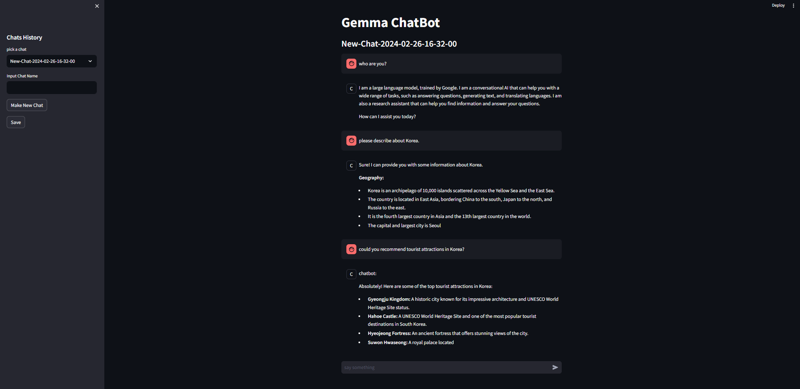

# Gemma Chatbot with PyTorch and Streamlit

you can download model below link<br/>
https://www.kaggle.com/models/google/gemma/frameworks/pyTorch

Gemma PyTorch library<br/>
https://github.com/google/gemma_pytorch

Gemma PyTorch tutorial<br/>
https://ai.google.dev/gemma/docs/pytorch_gemma

## setting
```sh
# install pytorch which fit your enviornment
pip install -r requirements.txt
```

---
## How To use

```sh
streamlit run main.py
```

